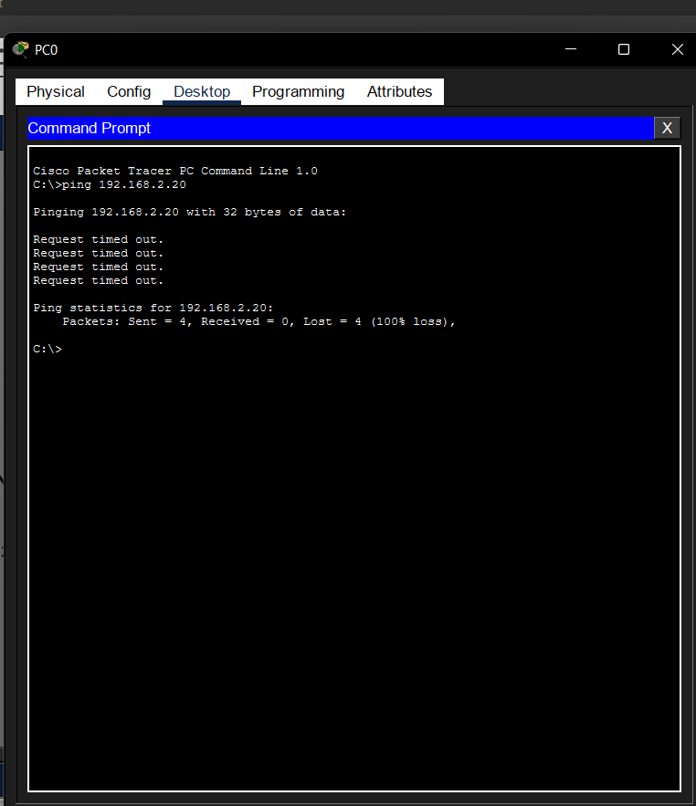
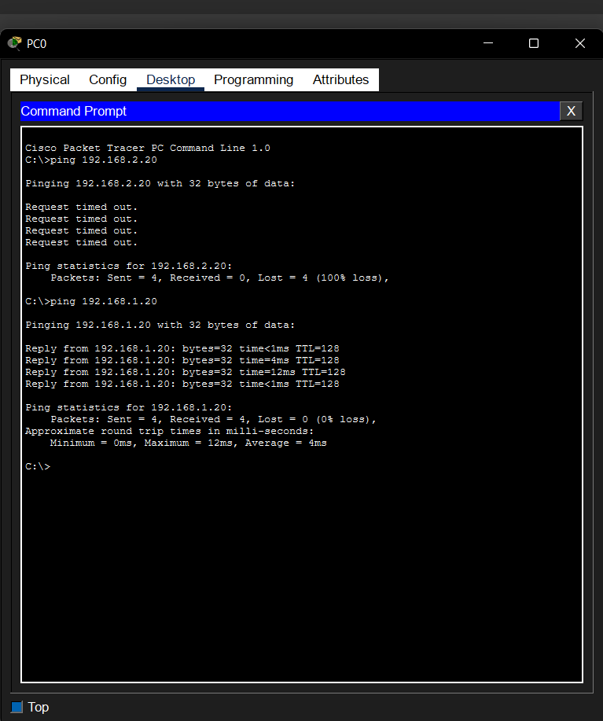

# Lab 02 – Understanding IP Addressing

## Objective

Understand how IP addresses and subnet masks affect communication between devices on a network.

## Devices Used

| Device | Quantity |
|---------|---------:|
| PC | 2 |
| Cisco 2960-24TT Switch | 1 |
| Copper Straight-Through Cable | 2 |

## Scenario 1 – Different Networks

### IP Configuration

| Device | IP Address | Subnet Mask |
|---------|------------|-------------|
| PC0 | 192.168.1.10 | 255.255.255.0 |
| PC1 | 192.168.2.20 | 255.255.255.0 |

### Result

The ping failed because the devices were on different networks and there was no router to forward traffic.

---

## Scenario 2 – Same Network

### IP Configuration

| Device | IP Address | Subnet Mask |
|---------|------------|-------------|
| PC0 | 192.168.1.10 | 255.255.255.0 |
| PC1 | 192.168.1.20 | 255.255.255.0 |

### Result

The ping was successful because both devices were on the same network.

---

## Skills Learned

- Configuring static IPv4 addresses.
- Understanding subnet masks.
- Identifying devices on the same network.
- Troubleshooting communication issues.

## Cybersecurity Connection

SOC analysts frequently investigate connectivity problems before determining whether an issue is caused by a cyberattack. Correctly identifying IP addressing problems helps reduce false alarms and speeds up incident investigation.
