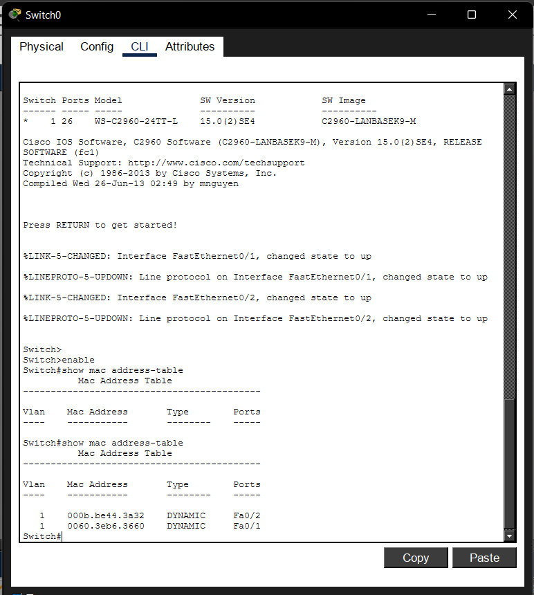

# Lab 03 – Understanding Network Switches

## Objective

Learn how a network switch forwards traffic by examining its MAC Address Table.

## Devices Used

| Device | Quantity |
|---------|---------:|
| PC | 2 |
| Cisco 2960-24TT Switch | 1 |
| Copper Straight-Through Cable | 2 |

## IP Configuration

| Device | IP Address | Subnet Mask |
|---------|------------|-------------|
| PC0 | 192.168.1.10 | 255.255.255.0 |
| PC1 | 192.168.1.20 | 255.255.255.0 |

## Verification

Successfully pinged PC1 from PC0.

## MAC Address Table

## Skills Learned

- Accessing the Cisco CLI
- Using Privileged EXEC Mode
- Viewing the MAC Address Table
- Understanding how switches learn connected devices

## Common Mistakes

- Forgetting to enter `enable` before running privileged commands.
- Expecting the MAC table to be populated before any traffic has been sent.
- Confusing MAC addresses with IP addresses.

## Cybersecurity Connection

SOC analysts may use MAC address information to identify devices on a network, investigate unauthorized connections, and support incident response activities.
