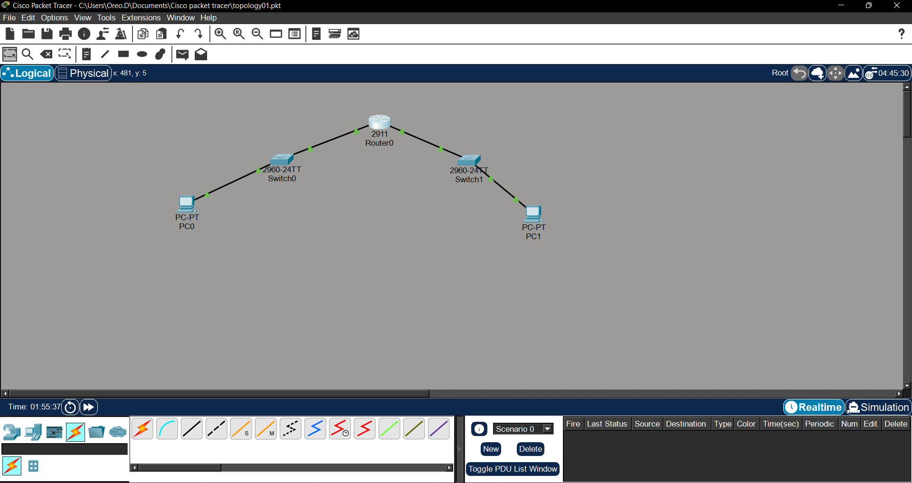
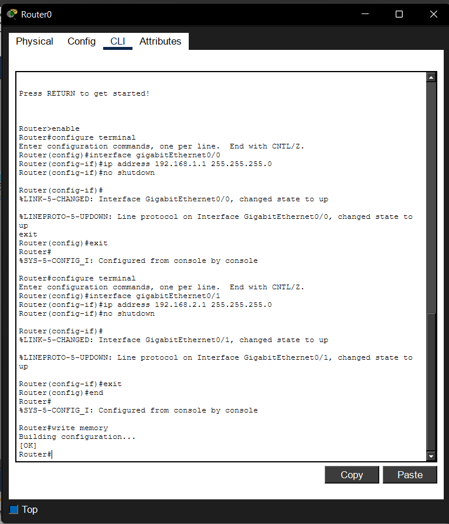
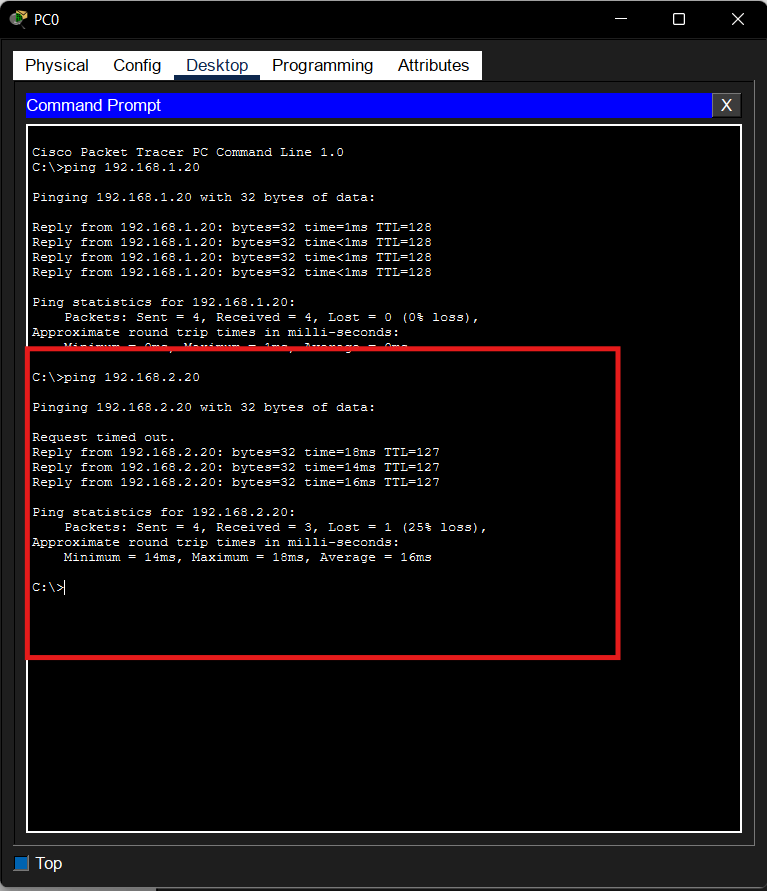

# Lab 05 – Routing Between Two Networks

## Objective

Configure a Cisco router to allow communication between two different IPv4 networks.

## Devices Used

| Device | Quantity |
|---------|---------:|
| PC | 2 |
| Cisco 2960 Switch | 2 |
| Cisco 2911 Router | 1 |

## Network Topology

## IP Addressing

| Device | IP Address | Default Gateway |
|---------|------------|-----------------|
| PC0 | 192.168.1.10 | 192.168.1.1 |
| PC1 | 192.168.2.20 | 192.168.2.1 |

## Router Configuration

Configured:

- GigabitEthernet0/0 → 192.168.1.1/24
- GigabitEthernet0/1 → 192.168.2.1/24

## Verification

Successfully pinged PC1 from PC0 through the router.

## Skills Learned

- Configuring router interfaces
- Assigning default gateways
- Enabling router interfaces with `no shutdown`
- Routing traffic between different networks

## Common Mistakes

- Forgetting `no shutdown`
- Configuring the wrong IP address
- Entering the wrong default gateway on the PCs
- Connecting the wrong router interface

## Cybersecurity Connection

Routers control traffic between networks. SOC analysts use router configurations and logs to investigate suspicious traffic, identify misconfigurations, and understand how attackers may move between network segments.
