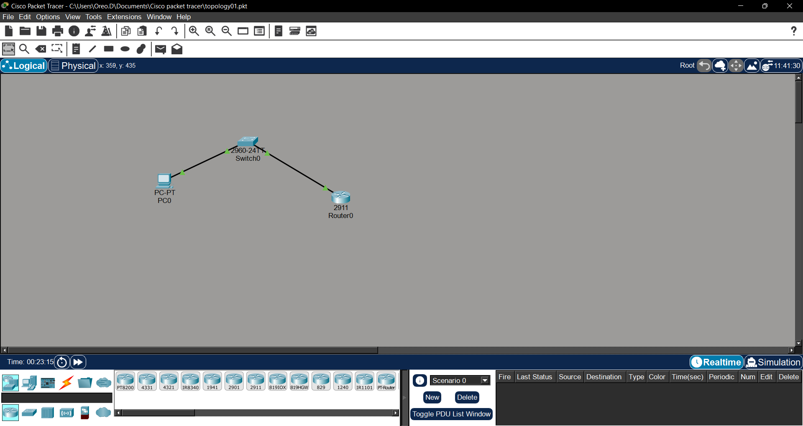
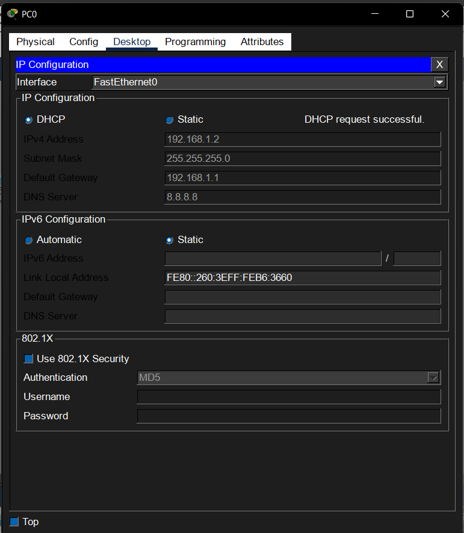
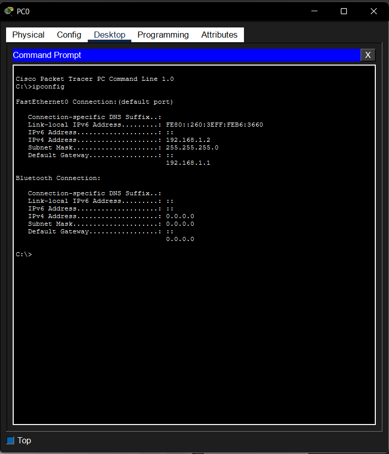

# Lab 06 – Configuring DHCP

## Objective

Configure a Cisco router to act as a DHCP server and automatically assign IP addresses to clients.

## Devices Used

| Device | Quantity |
|---------|---------:|
| PC | 1 |
| Cisco 2960 Switch | 1 |
| Cisco 2911 Router | 1 |

## Network Topology

## DHCP Configuration

- Router IP: 192.168.1.1/24
- DHCP Pool Name: OFFICE
- Excluded Addresses: 192.168.1.1 - 192.168.1.20
- Default Gateway: 192.168.1.1
- DNS Server: 8.8.8.8

## Verification

### PC IP Configuration

### Command Prompt

## DORA Process

1. Discover
2. Offer
3. Request
4. Acknowledge

## Skills Learned

- Configuring DHCP on a Cisco router
- Creating a DHCP pool
- Excluding IP addresses
- Automatically assigning network settings
- Verifying DHCP with `ipconfig`

## Common Mistakes

- Forgetting `no shutdown`
- Using the wrong network address in the DHCP pool
- Forgetting to click **DHCP** on the PC
- Not excluding the router's IP address

## Cybersecurity Connection

DHCP logs help SOC analysts identify which device was assigned a specific IP address during an investigation. They are valuable for tracing malicious activity, identifying rogue devices, and supporting incident response.
