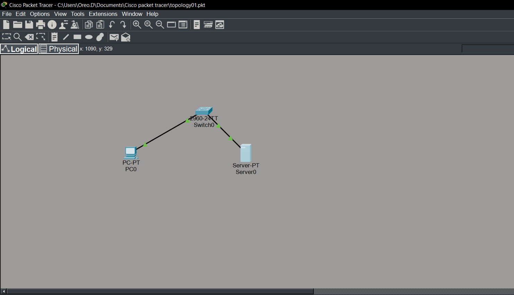
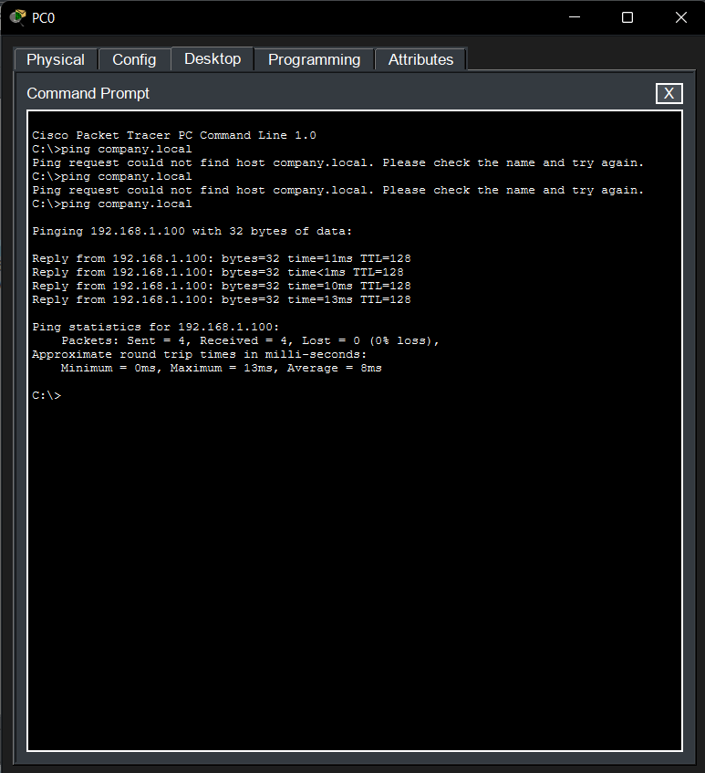

# Lab 07 – Understanding DNS

## Objective

Configure a DNS server and verify that a client can resolve a domain name to an IP address.

## Devices Used

| Device | Quantity |
|---------|---------:|
| PC | 1 |
| Cisco 2960 Switch | 1 |
| Server | 1 |

## Network Topology

## DNS Configuration

| Name | IP Address |
|------|------------|
| company.local | 192.168.1.100 |

## Client Configuration

| Setting | Value |
|---------|-------|
| IP Address | 192.168.1.10 |
| DNS Server | 192.168.1.100 |

## Verification

Successfully resolved `company.local` to `192.168.1.100`.

## Skills Learned

- Configuring a DNS server
- Creating an A Record
- Configuring a client DNS server
- Testing DNS resolution

## Common Mistakes

- Forgetting to enable the DNS service.
- Typing the wrong DNS server IP on the client.
- Entering the wrong hostname.
- Forgetting to click **Add** after creating the DNS record.

## Cybersecurity Connection

DNS is frequently abused by attackers for command-and-control communication, phishing, and DNS spoofing. Monitoring DNS requests helps SOC analysts detect suspicious activity early.
